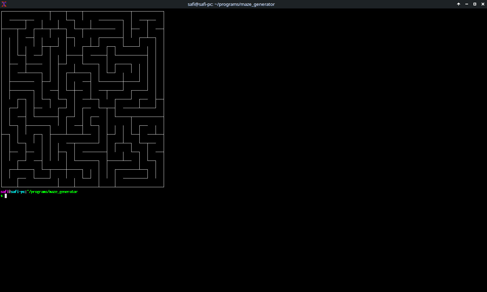

# Maze Generator

This program procedurally generates a maze of any size using the depth-search-first algorithm on the terminal. It uses the unicode characters from Box Drawing block and ANSI CSI escape codes to do as such.

## Use

To run it just type

./maze columns rows

like

./maze 20 20

if no arguments are given then a maze of 15x20 cells is generated by default.

## How to compile it?

It use everything standard no extra libraries are needed just type "make" to compile it.

## Linux Console
This program will run on Linux console outside of X11 as well though it might have missing fonts. If you then load the unifont psf fonts with setfont command before running this program.

To install unifont psf fonts on Debian/Ubuntu based systems do the following:

sudo apt install psf-unifont

In order to load the unifont psf fonts use the following command:

setfont /usr/share/consolefonts/Unifont-APL8x16.psf.gz
